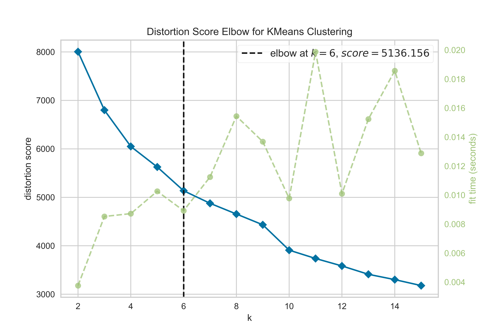

# 🧩 Customer Segmentation using Unsupervised Learning (K-Means Clustering)

This project performs end-to-end customer segmentation using unsupervised machine learning to identify behaviorally and economically distinct customer groups. The objective is to transform raw transactional and demographic data into actionable segments that can drive personalization, retention, and revenue optimization strategies.

The notebook demonstrates a full analytical pipeline: data understanding, preprocessing, feature engineering, optimal cluster selection, model training, and interpretable cluster profiling.

---

## 📑 Table of Contents

1. 🧩 [Overview](#overview)
2. 🎯 [Problem Statement](#problem-statement)
3. 🛠️ [Methodology](#methodology)

   * 🧹 [Data Preprocessing](#data-preprocessing)
   * 📐 [Optimal Cluster Selection](#optimal-cluster-selection)
   * 🤖 [Clustering Algorithm](#clustering-algorithm)
   * 📊 [Post-Clustering Analysis](#post-clustering-analysis)
4. 🧠 [Cluster Insights](#cluster-insights)
5. 💪 [Key Technical Strengths](#key-technical-strengths)
6. 📈 [Business Applications](#business-applications)

---

## 🧩 Overview

This project performs end-to-end customer segmentation using unsupervised machine learning to identify behaviorally and economically distinct customer groups. The objective is to transform raw transactional and demographic data into actionable segments that can drive personalization, retention, and revenue optimization strategies.

The notebook demonstrates a full analytical pipeline: data understanding, preprocessing, feature engineering, optimal cluster selection, model training, and interpretable cluster profiling.

---

## 🎯 Problem Statement

Given a multi-dimensional customer dataset containing demographic attributes and purchasing behavior across channels, the goal is to:

* Discover natural groupings of customers without labeled outcomes
* Quantify how each segment differs in age, income, spending, and engagement
* Translate statistical clusters into business-interpretable personas

---

## 🛠️ Methodology

### 🧹 1. Data Preprocessing

* Missing value handling and outlier sanity checks
* Feature scaling using Standardization to ensure distance-based model stability
* Selection of economically and behaviorally meaningful variables:

  * Age
  * Annual Income
  * Total Spend
  * Web Purchases
  * Store Purchases
  * Web Visits

---

### 📐 2. Optimal Cluster Selection

The Elbow Method is used to determine the appropriate number of clusters by analyzing within-cluster sum of squares (WCSS) as a function of K.

**Elbow Method Visualization**

---

### 🤖 3. Clustering Algorithm

* Algorithm: K-Means
* Distance Metric: Euclidean
* Initialization: k-means++
* Final K chosen based on Elbow inflection point

---

### 📊 4. Post-Clustering Analysis

* Cluster centroids transformed back to original feature scale
* Cluster-wise aggregation to create a `cluster_summary` table
* Business interpretation of each segment based on:

  * Spending power
  * Channel preference
  * Purchase frequency
  * Browsing-to-conversion behavior

---

## 🧠 Cluster Insights

| Cluster | High-Level Persona                                                          |
| ------- | --------------------------------------------------------------------------- |
| 0       | Low-income, low-spend, high-browse but low-conversion price-sensitive users |
| 1       | Older, high-income, extremely high-value omnichannel loyal customers        |
| 2       | Senior, conservative, low-engagement and low-spending customers             |
| 3       | Upper-middle income, digitally active, moderate-to-high value customers     |
| 4       | Affluent, younger, store-focused premium buyers with minimal browsing       |
| 5       | Wealthy senior customers with very high spend and strong purchase intent    |

Each cluster is quantitatively defined using mean values of income, age, total spend, web/store purchases, and visit frequency, enabling precise downstream targeting.

---

## 💪 Key Technical Strengths Demonstrated

* Proper use of scaling for distance-based learning
* Data-driven selection of K instead of arbitrary choice
* Statistical to business translation of unsupervised outputs
* Clean separation between modeling and interpretation layers
* Reproducible, inspection-friendly analysis via Pandas profiling and visualization

---

## 📈 Business Applications

* Precision marketing and campaign personalization
* Loyalty program design for high-LTV clusters
* Channel strategy optimization (web vs store)
* Churn risk identification for low-engagement segments
* Pricing and promotion sensitivity modeling

---

